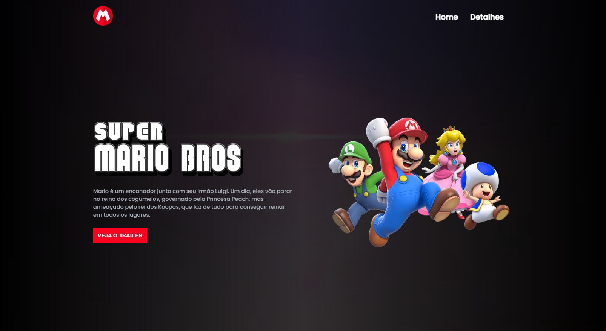
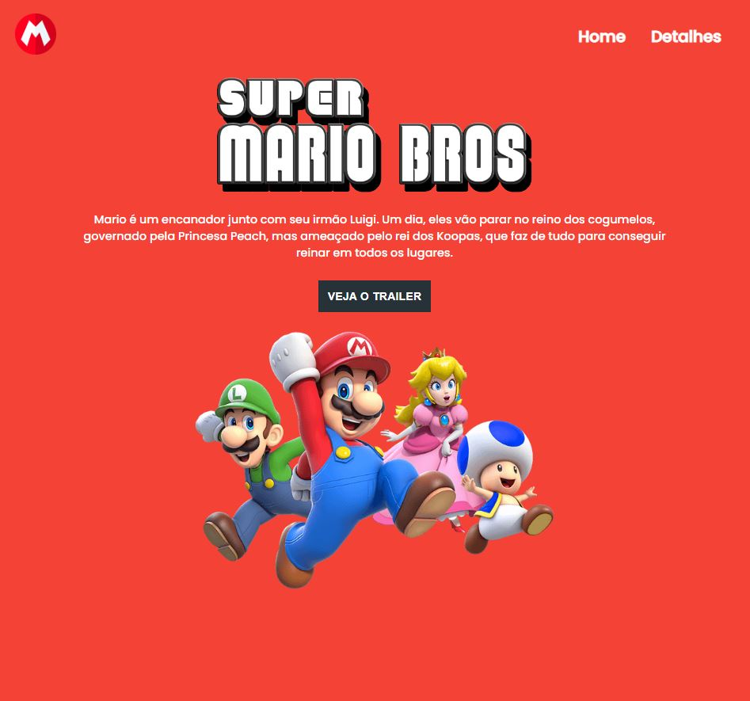

<h1 align="center"> Projeto Mario </h1>

Projeto pessoal 

  <a href="#tecnologias">Tecnologias</a>&nbsp;&nbsp;&nbsp;|&nbsp;&nbsp;&nbsp;
  <a href="#link">Link</a>

 

  

  

  

## Tecnologias

Esse projeto foi desenvolvido com as seguintes tecnologias:

- HTML
- CSS
- JavaScript
- Git e Github

## Link
https://jorge-saraiva.github.io/projeto-mario/
